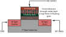
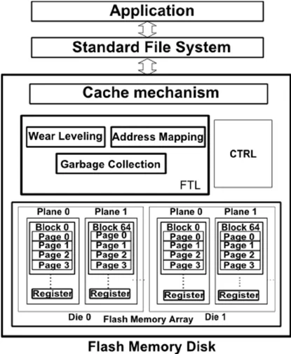
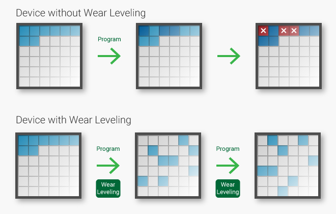
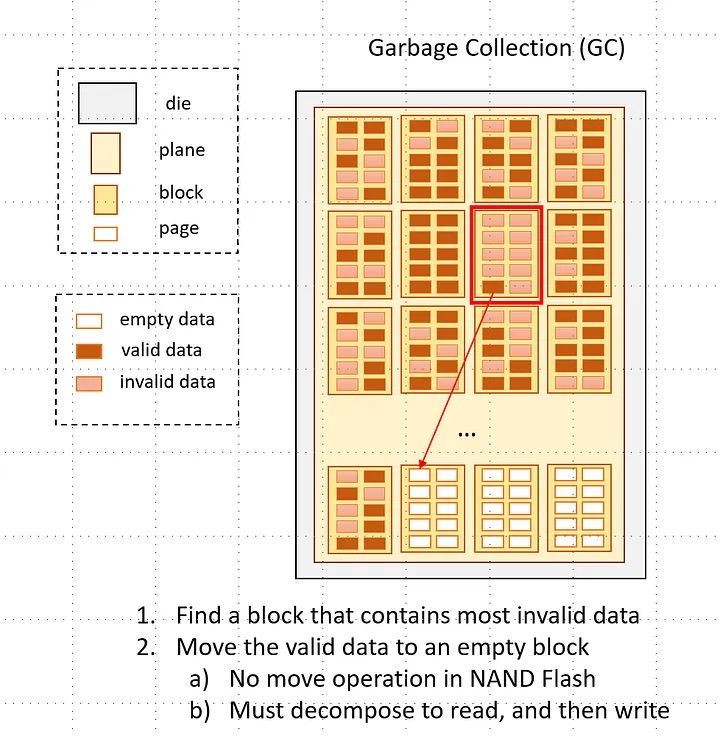

# NAND Flash Architecture and Flash Translation Layer (FTL)

This document provides a comprehensive technical overview of NAND Flash memory architecture, semiconductor physics and operating principles, Flash Translation Layer (FTL) mechanics, Wear Leveling strategies, Garbage Collection algorithms, and the internal design of the embedded Dhara FTL engine.

---

## 1. Semiconductor Physics and Cell Architecture

NAND flash memory is a non-volatile solid-state storage technology. Unlike volatile memories (such as SRAM and DRAM) that require continuous power to retain data states, NAND flash stores charge in isolated transistor regions, preserving logic values across power cycles.



### 1.1 The Floating Gate MOSFET (FGMOS)

A standard NAND flash cell is built upon an enhanced Metal-Oxide-Semiconductor Field-Effect Transistor (MOSFET) containing two gates:

- **Control Gate (CG):** Connected to the wordline (WL). Program and read voltages ($V_{pgm}$, $V_{read}$) are applied here.
- **Floating Gate (FG):** An electrically isolated conductive polysilicon island completely surrounded by dielectric insulating oxide layers (silicon dioxide, $\text{SiO}_2$). Because it is isolated, electrons introduced into the floating gate remain trapped indefinitely under typical operating conditions.
- **Oxide Layers:**
  - **Tunnel Oxide:** Located between the P-type silicon substrate (channel) and the floating gate. Typically 7 to 10 nm thick.
  - **Inter-poly Dielectric (IPD):** Usually an Oxide-Nitride-Oxide (ONO) sandwich between the floating gate and the control gate to ensure high capacitive coupling.
- **Source and Drain:** Heavily doped N+ regions within the P-type substrate connected along the bitline series strings.

### 1.2 Program Operation (Fowler-Nordheim Tunneling)

Programming a cell transitions its logical state from an erased state (`1`) to a programmed state (`0` in SLC):

1. **High Voltage Application:** A high positive programming pulse (e.g., $V_{pgm} \approx 15\text{V} - 20\text{V}$) is applied to the Control Gate, while the Source, Drain, and Substrate are tied to 0V (ground).
2. **Band Bending and Electric Field:** The large potential difference generates an intense electric field across the thin tunnel oxide layer ($> 10\text{ MV/cm}$).
3. **Fowler-Nordheim (FN) Tunneling:** Under this field, the triangular potential barrier of the conduction band narrows. Electrons from the inversion layer in the P-substrate channel tunnel quantum-mechanically through the barrier into the conduction band of the floating gate.
4. **Charge Trapping:** Once inside the floating gate, electrons are trapped by the surrounding dielectric barriers. The net negative charge shifts the threshold voltage ($V_{th}$) of the transistor in the positive direction:
   $$\Delta V_{th} = -\frac{\Delta Q_{fg}}{C_{ox}}$$
   where $\Delta Q_{fg}$ is the trapped charge and $C_{ox}$ is the gate capacitance.

### 1.3 Read Operation

To sense the programmed state of a target cell:

- An intermediate reference read voltage ($V_{read\_ref}$) is applied to its Control Gate.
- Pass voltages ($V_{pass} \approx 4.5\text{V} - 6\text{V}$) are applied to the Control Gates of all unselected cells in the same NAND string, turning them fully ON as pass transistors regardless of their stored charge.
- **Erased Cell (Logic `1`):** No trapped electrons $\rightarrow$ lower $V_{th}$. When $V_{read\_ref} > V_{th}$, the channel conducts current from Drain to Source (bitline current sensed).
- **Programmed Cell (Logic `0`):** Trapped electrons screen the control gate field $\rightarrow$ higher $V_{th}$. $V_{read\_ref} < $V_{th}$, the channel remains cut off, and no bitline current flows.

### 1.4 Erase Operation

NAND flash cannot selectively remove charge from an individual transistor cell:

- A high positive voltage ($V_{erase} \approx 20\text{V}$) is applied to the P-well / substrate, while the Control Gates of an entire block are grounded (0V).
- Electrons in the floating gates tunnel back across the tunnel oxide into the P-well via reverse FN tunneling.
- Because the P-well is shared across all cells in an entire erase block, **erasing must be performed at the block level**, resetting all bits in that block to `1` (all bytes `0xFF`).

### 1.5 Wear and Oxide Degradation

During write and erase cycles:

- High-energy electrons repeatedly crossing the dielectric cause bond breaking and lattice defects inside the tunnel oxide.
- **Trap Generation and Stress-Induced Leakage Current (SILC):** Over time, trapped charges accumulate in the oxide, shifting baseline $V_{th}$ and increasing leakage.
- Eventually, the oxide integrity breaks down, leading to retention failures, program disturbance, and bad blocks.

---

## 2. NAND Flash Structural Organization and Constraints

NAND flash memory is organized hierarchically into:

- **Die (LUN):** An autonomous array chip capable of executing independent commands.
- **Plane:** Sub-division of a die sharing page buffers. Operations can execute concurrently across planes (multi-plane operations).
- **Block (Erase Block):** The smallest unit that can be erased. Typically consists of 64 to 256 pages (e.g., 128 KB to 2 MB).
- **Page:** The smallest unit that can be programmed (written) and read. Typically 2 KB to 16 KB, plus an Out-Of-Band (OOB) spare area.
- **Out-of-Band (OOB) / Spare Area:** A secondary region per page (e.g., 64 to 512 bytes) reserved for Error Correction Codes (ECC), bad block markers, and metadata.

```
+----------------------------------------------------------------+
|                             NAND DIE                           |
|  +------------------------------+----------------------------+ |
|  |           Plane 0            |          Plane 1           | |
|  |  +------------------------+  |  +----------------------+  | |
|  |  | Block 0                |  |  | Block 1              |  | |
|  |  |  +------------------+  |  |  |  +----------------+  |  | |
|  |  |  | Page 0 (Data+OOB)|  |  |  |  | Page 0         |  |  | |
|  |  |  | Page 1 (Data+OOB)|  |  |  |  | Page 1         |  |  | |
|  |  |  | ...              |  |  |  |  | ...            |  |  | |
|  |  |  | Page 63          |  |  |  |  | Page 63        |  |  | |
|  |  |  +------------------+  |  |  |  +----------------+  |  | |
|  |  +------------------------+  |  +----------------------+  |  |
|  +------------------------------+----------------------------+ |
+----------------------------------------------------------------+
```

### Fundamental Physical Constraints:

1. **Erase-Before-Write (No In-Place Overwrites):** A page cannot be rewritten without first erasing the entire block containing it.
2. **Sequential Page Programming:** Within an erase block, pages must generally be written in sequential order from page 0 up to page $N-1$. Random page writes within an open block are prohibited on modern devices.
3. **Asymmetric Granularity:** Reads and writes operate in pages (e.g., 2 KB), while erases operate in blocks (e.g., 128 KB or 64 pages).
4. **Finite Endurance:** Each block can endure a limited number of Program/Erase (P/E) cycles (e.g., 100,000 for SLC, 3,000 for MLC, 1,000 for TLC).
5. **Bit Flips & Read/Program Disturb:** Repeated read or write operations to neighboring cells disturb stored charges, introducing bit flips that mandate Error Correction Codes (ECC).

---

## 3. Flash Translation Layer (FTL)

Because traditional operating systems and filesystems (FAT, ext4, NTFS, raw block devices) expect symmetric, random read/write, in-place overwritable 512-byte or 4-KB sectors, NAND flash cannot be exposed directly to them.

The **Flash Translation Layer (FTL)** is an intermediate software/firmware layer positioned between the host file system and the raw flash memory interface.



### 3.1 Core Responsibilities of an FTL

1. **Logical-to-Physical Address Mapping:** Translates Logical Block Addresses (LBA) requested by the host into Physical Page Addresses (PPA) on the flash memory.
2. **Out-of-Place Writes:** When a logical sector is overwritten, the FTL writes the updated data to a new, pre-erased physical page, marks the old physical page as "invalid" (stale), and updates the translation map.
3. **Garbage Collection (GC):** Reclaims blocks containing invalid pages by copying surviving valid pages to fresh blocks and erasing the victim block.
4. **Wear Leveling (WL):** Distributes erase cycles uniformly across all physical blocks on the chip to prevent premature failure of heavily written blocks.
5. **Bad Block Management (BBM):** Identifies factory-defective blocks and runtime-failed blocks, keeping them permanently out of allocation tables.
6. **Power-Loss Recovery (PLR) and Atomicity:** Guarantees that metadata and user data remain consistent and recoverable following unexpected power loss.

### 3.2 Address Mapping Schemes

| Mapping Scheme           | Mechanism                                                                                   | Advantages                                                         | Disadvantages                                                                                        |
| :----------------------- | :------------------------------------------------------------------------------------------ | :----------------------------------------------------------------- | :--------------------------------------------------------------------------------------------------- |
| **Page-Level Mapping**   | Every LBA maps to any physical page on the device.                                          | Best performance, lowest write amplification, highest flexibility. | Large RAM footprint: mapping table requires ~1 MB RAM per 1 GB flash.                                |
| **Block-Level Mapping**  | LBA block maps to physical block; page offset is fixed.                                     | Very small RAM footprint.                                          | Extremely poor performance for random writes; high write amplification due to frequent block merges. |
| **Hybrid Mapping**       | Data blocks mapped at block level; active/update log blocks mapped at page level.           | Balanced RAM consumption and write flexibility.                    | Complex merge operations (full, switch, partial merges); unpredictable latency.                      |
| **Demand Paging (DFTL)** | Full page-level mapping stored in flash pages; only active translation pages cached in RAM. | Low RAM usage with page-level granularity.                         | Cache-miss penalty introduces additional flash read/write operations.                                |

---

## 4. Wear Leveling (WL)

NAND flash blocks fail when their tunnel oxide ruptures or degrades beyond the correction capability of ECC. If write activity is concentrated in a specific logical region (such as filesystem partition tables, FAT allocation tables, or database journals), the corresponding physical blocks would burn out rapidly while the remainder of the chip remains unused.

Wear leveling ensures that every block experiences approximately the same number of P/E cycles over the device lifetime.



### 4.1 Dynamic Wear Leveling

- Monitored blocks: **Free and active blocks written with changing (dynamic) data**.
- Mechanism: When selecting a free block to write new data or garbage collect, the controller picks the block with the **lowest erase count** among available free blocks.
- Limitation: Long-lived static data (read-only operating system files, static firmware, stored images) remains sitting in blocks that never get erased. The erase counts of free/dynamic blocks continue rising, leaving the static blocks at low counts and wasting their lifetime.

### 4.2 Static Wear Leveling

- Monitored blocks: **All blocks across the entire medium**, including blocks holding cold (static) data.
- Mechanism:
  1. The controller monitors the delta between the maximum erase count ($EC_{max}$) and minimum erase count ($EC_{min}$) across the device.
  2. When the threshold is exceeded:
     $$EC_{max} - EC_{min} > \Delta_{threshold}$$
  3. Cold blocks with low erase counts are relocated: their valid static data is copied to a block with high erase count.
  4. The low-erase-count block is erased and placed into the free pool for high-frequency dynamic writes.
- Outcome: Global wear across the entire flash chip is balanced.

---

## 5. Garbage Collection (GC) and Write Amplification

Because flash pages cannot be updated in-place, overwriting a sector generates a valid page in an open block and leaves behind an invalid page in the old block. Over time, free blocks are exhausted, leaving blocks fragmented with mixed valid and invalid pages.



### 5.1 Garbage Collection Workflow

1. **Victim Block Selection:** The GC policy selects a target block for reclamation based on metrics such as:
   - Lowest valid page count (Greedy policy: minimizes relocation overhead).
   - Cost-benefit policy (takes into account block age and invalid data ratio).
   - Wear leveling considerations.
2. **Valid Page Relocation:** Valid pages remaining in the victim block are read into controller RAM (or internal flash copy buffers) and written sequentially into an active free allocation block.
3. **Map Pointer Updates:** The FTL mapping structures are updated so that the LBAs of the relocated pages point to their new physical addresses.
4. **Block Erase:** Once all valid pages are copied, the victim block contains only invalid data. An erase command is issued to the flash chip.
5. **Free Pool Return:** The freshly erased block (reset to all `0xFF`) is returned to the free block pool.

### 5.2 Write Amplification Factor (WAF)

Garbage collection causes internal data movement beyond what was requested by the host. This phenomenon is quantified by the **Write Amplification Factor (WAF)**:

$$\text{WAF} = \frac{\text{Bytes Written to NAND Flash (Host Data + Internal GC Moves)}}{\text{Bytes Written by Host Controller}}$$

- Ideal WAF = $1.0$ (every host write triggers exactly one flash page write).
- Minimizing WAF requires:
  - Over-provisioning (OP): Allocating extra physical capacity beyond user-visible capacity (e.g., 7% to 28% spare blocks).
  - Explicit Trim/Discard commands: Allowing the host OS to notify the FTL when file data is deleted, avoiding redundant copy-backs of deleted files during GC.
  - Hot/Cold data separation: Grouping frequently updated data into separate blocks from static data.

---

## 6. The Dhara FTL Architecture

**Dhara** is a specialized, open-source NAND Flash Translation Layer written by Daniel Beer, designed specifically for small microcontrollers (e.g., ARM Cortex-M, ESP32) with constrained RAM and compute resources.

Unlike desktop SSD FTLs that rely on megabytes of DRAM to maintain flat page tables, Dhara provides a fully functional, mutable block device interface with minimal RAM overhead and deterministic performance.

### 6.1 Key Architectural Properties

- **RAM Footprint:** Extremely small (a few hundred bytes of RAM context). It does not hold the full translation table in RAM.
- **Strict Wear Leveling:** Provides guaranteed wear leveling where the erase count difference between any two healthy blocks is at most 1.
- **Atomic Operations & Data Integrity:** Sector writes and trims are atomic. State rolls back cleanly to the last synchronized checkpoint upon sudden power failure.
- **Logarithmic Complexity:** All operations, including startup recovery and lookups, are worst-case $\mathcal{O}(\log N)$ in the size of the flash array (assuming uniform bad block distribution).
- **Zero OOB Data Consumption:** Dhara does not require user metadata in the flash spare/OOB area. The entire OOB area can be dedicated to hardware/software ECC and factory bad-block markers.

### 6.2 Journal Ring Buffer and Checkpointing

Dhara structures the entire NAND chip as a persistent circular ring buffer (journal).

Pages are allocated sequentially through the journal queue:

- **Enqueue:** Adds a newly written page to the front (head) of the queue.
- **Dequeue:** Reclaims a page from the back (tail) of the queue.

#### Memory and Checkpoint Layout

To balance write efficiency with fast recovery, Dhara groups pages into Checkpoint Groups:

- Configuration parameters:
  - `log2_ppb`: Base-2 logarithm of pages per erase block (e.g., $2^6 = 64$ pages/block).
  - `log2_ppc`: Base-2 logarithm of pages per checkpoint group (e.g., $2^2 = 4$ pages/group).

A single erase block is laid out with regular data pages interleaved with periodic checkpoint (`cp`) pages:

```
+-------------------------------------------------------+
| data page 0 | data page 1 | data page 2 |   cp page   |
+-------------------------------------------------------+
| data page 3 | data page 4 | data page 5 |   cp page   |
+-------------------------------------------------------+
| data page 6 | data page 7 | data page 8 |   cp page   |
+-------------------------------------------------------+
| data page 9 | data page 10| data page 11|   cp page   |
+-------------------------------------------------------+
```

Each checkpoint page encapsulates:

1. **Checkpoint Header (16 bytes):**
   - Magic identifier (`"Dha"`).
   - `epoch`: 8-bit wrap-around counter indicating how many times the journal circled the physical chip.
   - `tail`: Physical address of the last active page in the queue.
   - `bb_current`: Count of bad blocks encountered before the current head.
   - `bb_last`: Estimation of the total bad blocks across the medium.
2. **Checkpoint Cookie (4 bytes):** Stores the active number of currently mapped logical sectors.
3. **Metadata Array ($N \times 132$ bytes):** Contains metadata structures for each data page in the checkpoint group ($N = 2^{log2\_ppc} - 1$). Each entry stores:
   - `id` (32 bits): The logical sector address (LBA) associated with that page.
   - `alt_pointers` ($32 \times 4\text{ bytes}$): 32 alternate routing pointers implementing the functional radix tree.

### 6.3 Functional Radix Tree with Alt-Pointers

Dhara associates logical sector addresses (LBAs) with physical flash pages via a **persistent functional radix tree** represented without dedicated node pointers on flash.

In an ordinary binary radix tree of depth $H = 32$:

- Each node along the path from root to leaf has a branch pointer along the key's bit value, and an alternative pointer (_alt-pointer_) branching to the opposite subtree.
- In Dhara's scheme, because each write appends exactly one new leaf (the sector data) and updates the path to the root, only the alternate branch pointers need to be persisted.

#### Invariant of Alt-Pointers:

For any update record at level $k$ ($0 \le k < H$):

> $A_k$ is either `NULL` or points to the most recent update record whose logical sector address shares its first $k$ bits with the current sector.

#### Address Lookup Algorithm ($\mathcal{O}(H)$):

1. Start at the current root (the most recently written head page).
2. For bit index $i = 0 \dots H-1$:
   - If the current record is `NULL`, the sector is unmapped (`NOT_FOUND`).
   - If bit $i$ of the target logical address matches bit $i$ of the current page's logical address, continue along the path.
   - If bit $i$ differs, follow `alt_pointer[i]` to transition to the alternative subtree page.
3. When $i = H-1$ matches, the physical page contains the requested sector data.

### 6.4 Incremental Garbage Collection and Repacking

Because pages enter the front of the journal ring buffer and exit the tail, space reclamation operates incrementally:

1. **Inspection of the Tail Page:** Let $S$ be the logical sector address stored at the tail (leftmost) page $P_{tail}$ of the journal.
2. **Liveness Verification:** Perform a lookup on sector $S$ starting from the head.
   - **Case 1 (Page is Obsolete/Stale):** If the lookup resolves to a more recent physical page $P_{new} \ne P_{tail}$, $P_{tail}$ is garbage. It is immediately dequeued.
   - **Case 2 (Page is Still Valid/Active):** $P_{tail}$ holds active data.
     - **Repack Operation:** Dhara reads the data from $P_{tail}$ and enqueues an exact update copy at the head of the journal.
     - Following the repack, $P_{tail}$ becomes obsolete and is safely dequeued.
3. **Block Erase:** When the tail pointer advances across an entire erase block boundary, the vacated block is fully erased and prepared for future head writes.

#### Overflow Avoidance:

To ensure the journal never fills up completely (which would prevent writing repack pages), Dhara enforces an operational capacity ceiling:
$$C_m = C_j \times \frac{R}{R + 1}$$
where $C_j$ is the usable journal capacity (minus bad-block margin) and $R \ge 1$ is the collection ratio. Whenever the journal occupancy exceeds $C_m$, Dhara performs $R$ incremental garbage collection steps for every host write.

### 6.5 Power-Failure Recovery and Bad-Block Handling

- **Power-Loss Recovery:** On boot, `dhara_map_resume()` scans the checkpoint headers using binary search techniques across the journal ring buffer to locate the newest valid checkpoint and reconstruct the head and tail pointers. Any uncommitted writes occurring after the last sync point are discarded cleanly.
- **Runtime Bad Blocks:** If programming or erasing fails due to block failure:
  1. The journal marks the block as bad via the low-level driver.
  2. The recovery routine scans the readable pages belonging to the failed block.
  3. Valid pages are repacked into healthy blocks at the head of the journal.
  4. The internal bad block tally is adjusted without compromising map consistency.

---

## 7. Comparative Summary: Dhara vs Traditional FTL

| Feature              | Enterprise / Consumer FTL (SSDs, eMMC)                         | Dhara Embedded FTL                                                  |
| :------------------- | :------------------------------------------------------------- | :------------------------------------------------------------------ |
| **Target Hardware**  | 32/64-bit multi-core controllers with external DRAM            | Ultra-low-power microcontrollers (ESP32, STM32, Cortex-M)           |
| **RAM Requirement**  | Tens of Megabytes to Gigabytes of DRAM                         | $< 1\text{ KB}$ internal SRAM                                       |
| **Lookup Mechanism** | Cached flat page translation table                             | On-flash functional radix tree via Alt-Pointers                     |
| **Wear Leveling**    | Cost-benefit static and dynamic pool balancing                 | Ring-buffer journal guaranteeing maximum erase count $\Delta \le 1$ |
| **OOB Usage**        | Heavily used for metadata, LBA tags, sequence numbers          | $0\text{ bytes}$ required; 100% of OOB dedicated to ECC and markers |
| **Startup Scan**     | Reconstructs tables by scanning checkpoints and block journals | $\mathcal{O}(\log N)$ binary search across checkpoint headers       |
